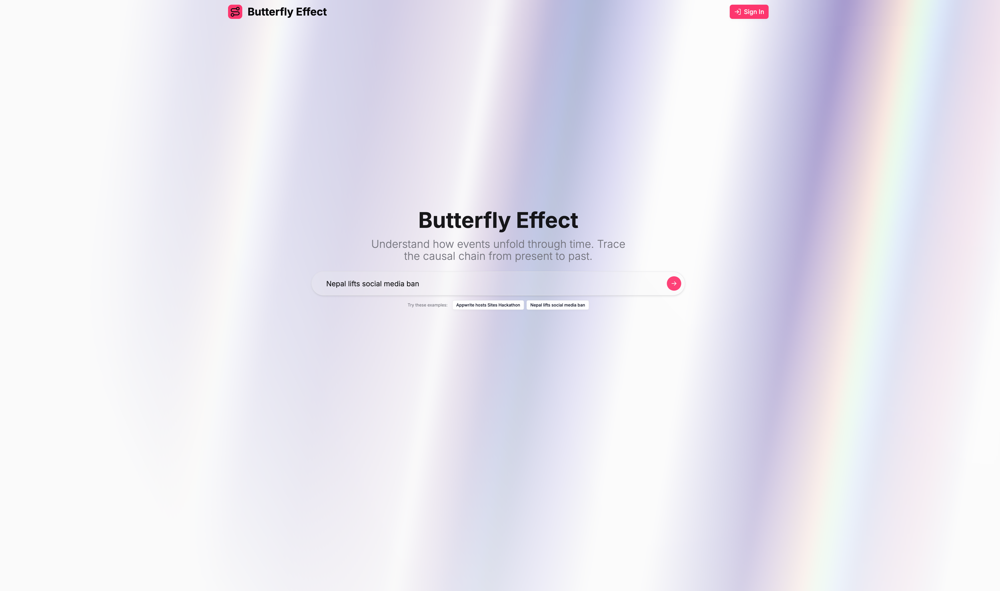
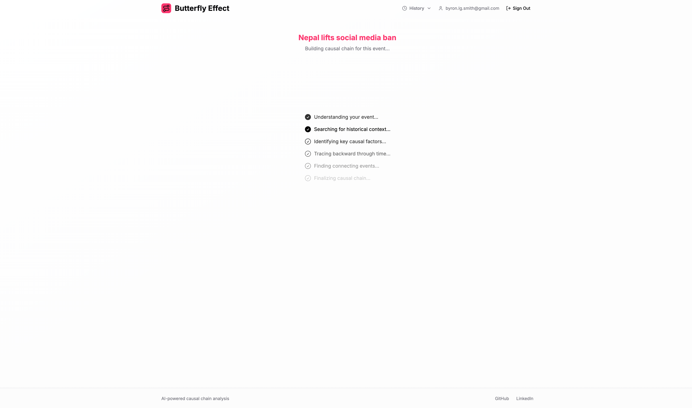
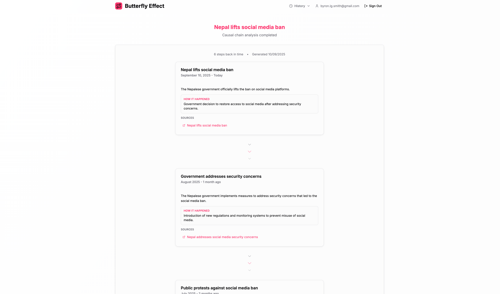
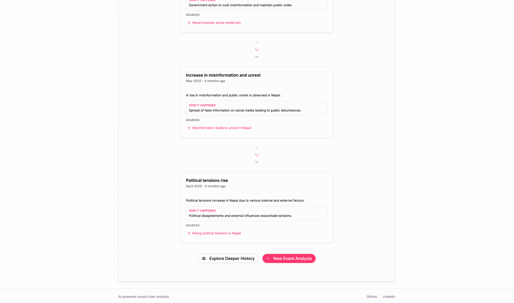

# Butterfly Effect

**This project was created as part of the [Appwrite Sites Hackathon](https://hackathon.appwrite.network) 2025.**

---

## Project Description

Butterfly Effect is an interactive site that helps users uncover the _why_ behind today’s events. By entering any recent headline, the app uses a reasoning LLM to generate a reverse-chronological chain of causes—showing the sequence of decisions, shocks, and trends that led from past to present.

The results are displayed as an engaging, animated timeline of **“cause cards”** with confidence levels, explanatory mechanisms, and optional supporting sources. Users can expand, share, or export these timelines instantly. The experience is **fast, frictionless, and accessible**—no signups or complex workflows required.

Butterfly Effect moves beyond “what happened” to reveal _why it happened_, turning overwhelming streams of news into **intuitive visual stories**. It makes sense of complexity in a way that feels both educational and exciting, showing how history unfolds into the present moment.

Butterfly Effect uses Appwrite Functions to run LLM agents, Appwrite Sites for SPA hosting, and Appwrite Storage for timeline exports.

---

## Inspiration Behind the Project

The inspiration came from _Price Wars_ by Rupert Russell, which illustrates how events like food shortages or political crises are rarely isolated—they are the result of hidden chains of cause and effect spanning nations and markets. That perspective stuck with me: we often know _what_ has happened, but rarely stop to ask _why_.

In today’s world of nonstop headlines, people are overwhelmed by the _what_ and deprived of tools to explore the _why_. Butterfly Effect fills that gap. It transforms abstract complexity into a timeline that is **visual, interactive, and verifiable**, helping anyone—from students to professionals—trace causality in a way that sparks both understanding and curiosity.

---

## Tech Stack

-   **Frontend:** Vite, React, TypeScript, Tailwind CSS, shadcn/ui
-   **Backend / Logic:** Python, Pydantic, LangChain, LangGraph
-   **Models + Tools:** OpenAI Reasoning (via langchain-openai), Tavily Search
-   **Platform / Infra:** Appwrite (Functions, Sites, Storage, optional Auth)

---

## Repository Link

[https://github.com/byronxlg/causeflow](https://github.com/byronxlg/causeflow)

## Deployed Site

[https://butterfly.appwrite.network](https://butterfly.appwrite.network)

---

## Screenshots

Landing and timeline views of Butterfly Effect:

